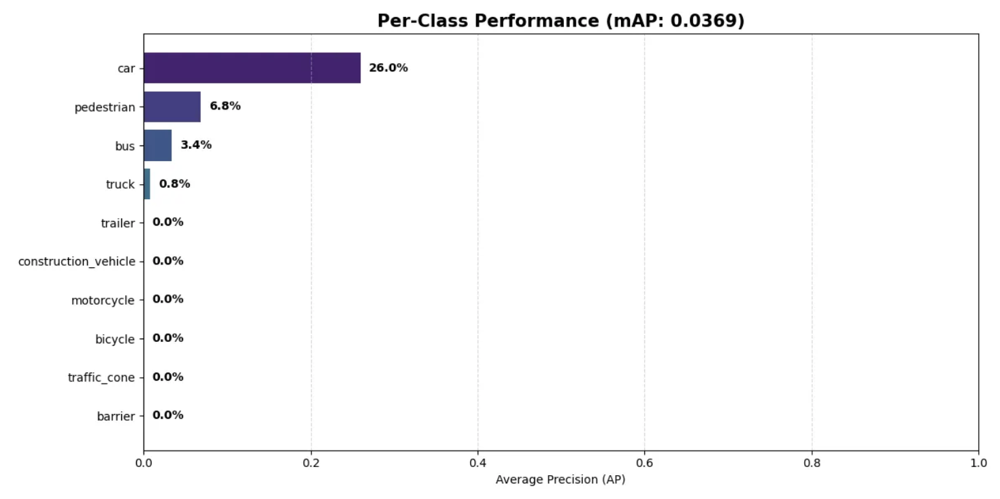
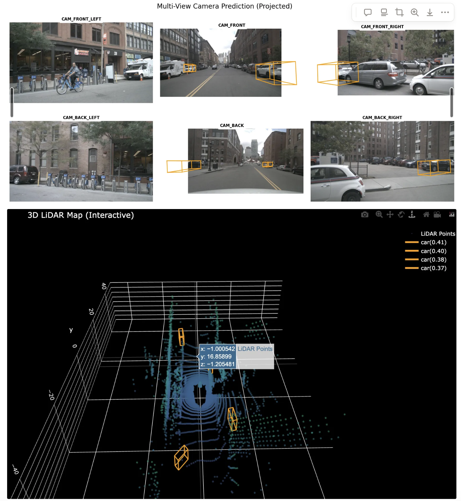
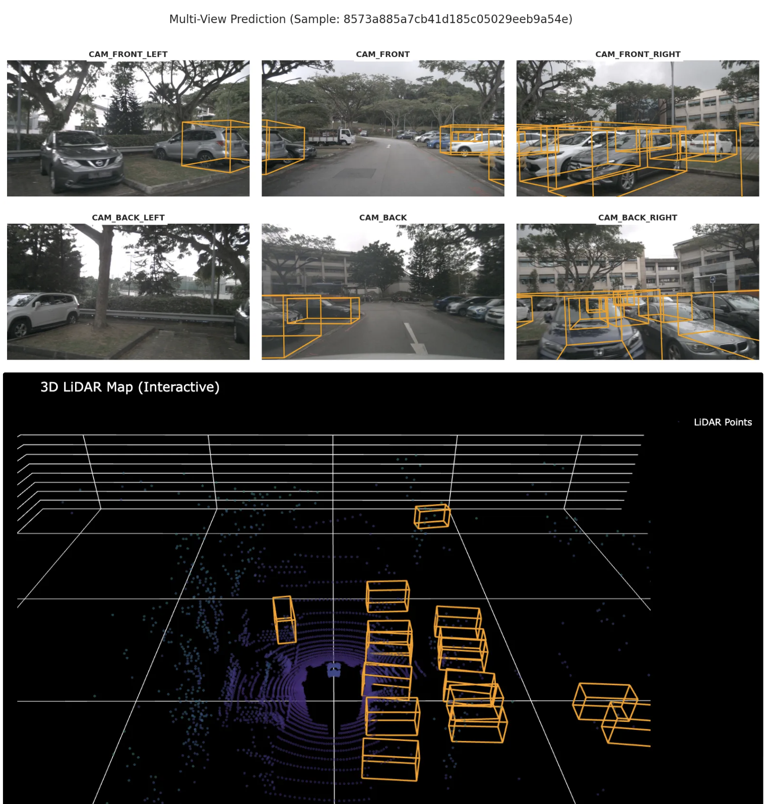
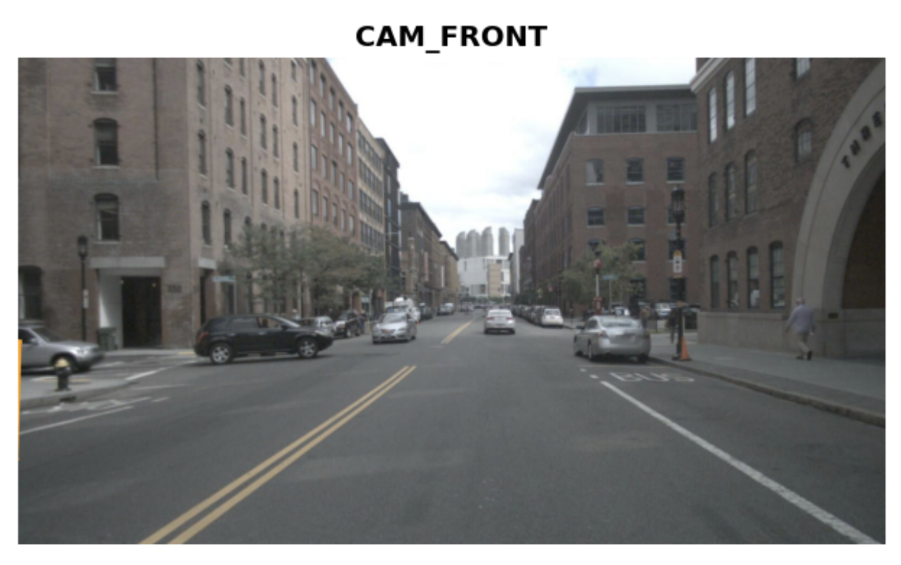

# 3D Object Detection with PointPillars on nuScenes-Mini

## 📖 프로젝트 개요
본 프로젝트는 **MMDetection3D** 프레임워크 내에서 **PointPillars** 아키텍처를 사용하여 **LiDAR 기반 3D 객체 탐지(3D Object Detection)** 시스템을 구현하기 위한 프로젝트입니다.
**Google Colab L4 GPU** 환경에 맞춰 학습 파이프라인을 최적화하고, 제한된 데이터셋인 **nuScenes v1.0-mini** 환경에서의 성능 특성과 한계점을 분석하는 것을 목표로 설정했습니다.

## 🛠️ 개발 환경 및 기술 스택
* **하드웨어:** Google Colab L4 GPU (VRAM 24GB)
* **프레임워크:** MMDetection3D (OpenMMLab)
* **데이터셋:** nuScenes v1.0-mini (10개 씬)
* **모델:** PointPillars (Hard Voxelization, SECOND FPN)

## ⚙️ 학습 설정 최적화 전략 (L4 GPU 기준)
하드웨어 제약 및 데이터셋의 특성을 고려하여 Config 파일을 다음과 같이 튜닝했습니다.

| 튜닝 항목 | 설정값 | 선정 근거 |
| :--- | :--- | :--- |
| **Batch Size** | `4` | L4 GPU 메모리 안정성 확보 및 OOM(Out Of Memory) 방지. |
| **Sweeps** | `10` | 희소한(Sparse) 라이다 포인트 밀도를 높이기 위해 과거 10프레임 누적 사용. |
| **Scheduler** | `30 Epochs` | 적은 데이터로 최대한의 특징을 학습하기 위해 표준(24 Epoch)보다 길게 설정. |
| **Precision** | `AMP` | 자동 혼합 정밀도(FP16)를 사용하여 메모리 효율성 극대화. |

## 💥 주요 트러블슈팅 및 해결 과정
학습 파이프라인 구축 중 발생한 **In-training Validation 실패 이슈**를 분석하고, **Offline Validation 전략**을 통해 해결했습니다.

### 1. 발생한 문제 (Issue)
* **현상:** `train.py` 실행 시, 학습(Train) 단계는 정상 진행되나 검증(Validation) 단계 진입 시 에러 발생 및 프로세스 중단.
* **에러 메시지:**
  > `AssertionError: Samples in split doesn't match samples in predictions.`
  > `TypeError: NuScenesMetric.init() got an unexpected keyword argument 'version'`
* **원인 분석:**
  1.  **데이터셋 불일치:** `v1.0-mini` 데이터셋을 사용했으나, 내부 평가 라이브러리(nuscenes-devkit)가 기본 설정인 전체 데이터셋(trainval) 리스트와 대조하여 샘플 개수 불일치 발생.
  2.  **버전 호환성:** MMDet3D의 Config 파일 설정과 내부 소스 코드 간의 `version` 인자 전달 과정에서 충돌 발생.

### 2. 해결 전략 (Resolution Strategy)

**✅ [Step 1] 전략 수정: "Validation Bypass" (검증 제외)**
* 학습 도중 에러를 유발하는 평가(Evaluator) 프로세스를 아예 실행하지 않도록 Config를 수정했습니다.
* **조치 내용:**
  * `val_evaluator`, `val_dataloader` 설정을 `None`으로 제거.
  * `val_interval`을 `9999`로 설정하여 학습 중 평가 단계 진입을 원천 차단.
* **결과:** 에러 없이 `train.py`가 완주하고 모델 파일(.pth)이 정상적으로 생성됨.

**baseline config 파일을 가져와 val 검증을 끄기.**
'''bash
### 3. 검증 끄기 (학습 중 에러 방지)
val_cfg = None
val_dataloader = None
val_evaluator = None

**✅ [Step 2] 최종 워크플로우: "Offline Validation" (오프라인 검증)**
학습과 평가를 분리하여 안정성을 확보하고 최적의 모델을 선정하는 파이프라인을 구축했습니다.
1.  **Long Training:** 충분한 학습을 위해 30 Epoch으로 설정.
2.  **Frequent Saving:** 5 Epoch 마다 체크포인트(`epoch_5.pth`, `epoch_10.pth`...) 자동 저장.
3.  **Post-Evaluation:** 학습 종료 후, 저장된 모든 모델에 대해 별도로 `test.py`를 실행하여 JSON 결과 생성.
4.  **Best Model Selection:** `nuscenes-devkit`을 이용해 각 모델의 mAP / NDS 점수를 산출하고, 최고 성능 모델을 최종 선정.

## 📊 실험 결과

### 1. 정량적 분석 (Metrics)
Offline Validation 방식으로 산출된 최종 결과입니다.

| 지표 | 점수 | 분석 |
| :--- | :--- | :--- |
| **mAP** | **3.69%** | Mini 데이터셋의 절대적인 데이터 부족으로 인해 일부(차량, 보행자)에서는 유의미한 AP값을 보이나 전체 평균 정확도는 낮음. |
| **NDS** | **10.66%** | mAP 대비 높은 점수를 기록, 탐지된 객체의 위치/방향 추정은 유의미함을 시사. |
| **Car AP** | **26.0%** | **성공 사례.** 가장 데이터가 많은 '자동차' 클래스는 유의미한 학습 성과를 보임. |
| **Pedestrian AP** | **6.8%** | Voxel 해상도(0.25m)의 한계로 작은 객체 탐지에 어려움이 있음. |
| **Other AP** | 0.0% | 트럭, 자전거 등 희귀 클래스는 학습 샘플 부족으로 탐지 실패. |

### 2. 📊 클래스별 결과(10개)

### 3. 📊 임계값(Threshold)별 객체 검출 분포 분석

| 임계값 (Threshold) | 객체 수 (Count) | 비율 (Ratio) | 비고 (Note) |
| :--- | :---: | :---: | :--- |
| **> 0.1** | 11,384 | 100.0% | 🟢 전체 데이터 기준 |
| **> 0.2** | 1,745 | 15.3% | ✨ **비교적 정확한 시각화가 가능함.** |
| **> 0.3** | 635 | 5.6% | 🎯 매우 높은 확신 (정밀도 위주) |
| **> 0.4** | 312 | 2.7% | 🎯 매우 높은 확신 (정밀도 위주) |
| **> 0.5** | 140 | 1.2% | 🎯 매우 높은 확신 (정밀도 위주) |
| **> 0.6** | 43 | 0.4% | - |
| **> 0.7** | 8 | 0.1% | - |
| **> 0.8** | 0 | 0.0% | ❌ 검출 없음 |

### 4. 정성적 분석 (시각화)
#### 학습 후 추론과정을 거친 json파일로 시각화 및 검증 작업을 진행했습니다.

#### 몇몇 차량을 인식하긴 하지만 전체적인 인식률이 많이 떨어지며, 특히 작은 객체(보행자)에 대해서는 검출을 못하고 있음.

#### 차량이 많은 주차장 sence에서는 훨씬 인식을 더 잘하는 모습을 보이나, 정면으로 있는 차량의 경우 인식을 잘 못하는 경향을 보임.

## 🧐 성능 분석 및 결론
### 성능 심층 분석: PointPillars의 정면 객체 탐지 한계
### 1. 관찰된 현상 (Observation)
* **✅ 측면/대각선 탐지 (Success):** 차량의 측면이 보여 **'L자 형태'**나 **'직육면체'**의 윤곽이 뚜렷하게 잡히는 경우, PointPillars는 이를 차량으로 매우 정확하게 인식합니다.
* **❌ 정면/후면 탐지 (Failure):** 반면, 차량의 **정면**이나 **후면**만 보여 라이다 포인트가 **'납작한 일자(-)'** 형태의 점군으로 나타날 때, 모델이 이를 객체로 인식하지 못하는(False Negative) 현상이 빈번하게 발생했습니다.

###                 <정면차량에 대해서 아예 인식을 못하는 결과를 보여주는 예시.>

### 2. 원인 분석 (Root Cause Analysis)

**① Pillar 인코딩의 구조적 한계 (Loss of Vertical Features)**
* **PointPillars의 메커니즘:** 3D 공간을 수직 기둥(Pillar)으로 나눈 뒤, 이를 압축하여 **2D 가짜 이미지(Pseudo-image)**로 변환하여 학습합니다.
* **정보 소실:** 이 과정에서 **Z축(높이) 정보가 2D 평면으로 압축**됩니다. 차량 정면의 핵심 특징인 범퍼, 후드, 전면 유리로 이어지는 구조가 2D화 과정에서 뭉개지면서, 모델은 이를 단순한 얇은 벽, 혹은 배전함 등과 구분하기 어려워집니다.

**② Anchor-based 방식의 한계 (Shape Mismatch)**
* **Anchor Matching:** PointPillars는 미리 정의된 크기의 3D 박스(Anchor)를 데이터에 매칭시키는 방식입니다.
* **IoU 저하:** 차량 정면의 포인트 클라우드는 깊이(Depth) 정보가 부족하여 매우 얇은 형태로 나타납니다. 이는 학습된 **Anchor 박스의 기본 형태(직사각형)와 겹치는 영역(IoU)이 매우 낮게 계산**되게 만들어, 유효한 객체 후보군에서 탈락할 확률을 높입니다.

### 3. CenterPoint와의 비교 (Comparison)

| 비교 항목 | PointPillars (Anchor-based) | CenterPoint (Anchor-free) |
| :--- | :--- | :--- |
| **탐지 방식** | 미리 정의된 **Anchor Box**와 매칭 | 객체의 **중심점(Heatmap)** 추적 |
| **정면 탐지** | ❌ **취약:** 박스 모양(Shape)이 일치하지 않으면 무시됨 | ✅ **우수:** 형상이 납작해도 '중심점' 특징이 강하면 탐지 |
| **데이터 처리** | **Pillar (2D)**: 수직 정보 압축됨 | **Voxel (3D)**: 3D 입체 정보 유지 |

### 4. 데이터셋과 모델의 한계점
1.  **데이터 부족 (핵심 원인):** `v1.0-mini`는 전체 데이터셋의 약 1% 수준입니다. 딥러닝 모델이 다양한 객체의 일반적인 특징을 배우기에는 턱없이 부족한 양입니다.
2.  **클래스 불균형:** 전체 데이터의 90% 이상이 자동차와 보행자에 편중되어 있어, 희귀 클래스(자전거, 트럭)에 대한 학습이 이루어지지 않았습니다.
3.  **Voxel 해상도의 한계:** `[0.25, 0.25]` 크기의 Voxel은 차량 탐지에는 적합하나, 보행자나 트래픽 콘 같은 작은 물체를 표현하기에는 해상도가 너무 낮습니다. 위의 이미지처럼 상대적으로 작은 객체인 보행자에 대한 인식은 크게 떨어지는 것을 알 수 있었습니다.

### 향후 개선 방안
* **데이터 확장:** **nuScenes v1.0-trainval** (전체 데이터셋)을 사용하여 학습 시 mAP 40% 이상 달성 예상.
* **데이터 증강:** **CBGS (Class-Balanced Grouping and Sampling)** 기법을 적용하여 클래스 불균형 해소.
* **모델 튜닝:** 작은 물체 탐지를 위해 Voxel 크기를 `0.16m` 또는 `0.075m` (CenterPoint 설정)로 미세화.

## 🚀 실행 방법 (How to Run)
**-> 첨부한 ipynb코드 참조.**
